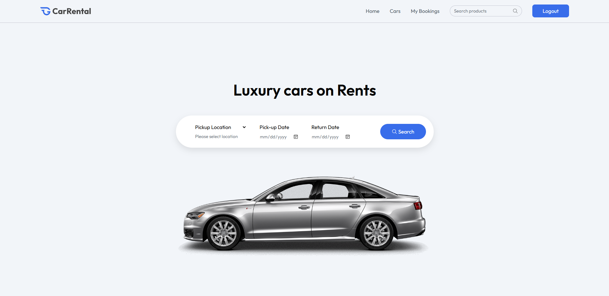

# 🚗 Car Rental System

_A Full-Stack Web Application for Car Rental Services using React & Spring Boot_


---



---

## 🧭 Table of Contents

1. [Introduction](#introduction-)
2. [Technologies](#technologies-)
3. [Features](#features-)
4. [Getting Started](#getting-started-)
5. [Contact](#contact-)
6. [Project Structure](#-project-structure)
7. [API Endpoints](#-api-endpoints)
8. [Running the Application](#-running-the-application)
9. [Contributing](#-contributing)

---

## 🌟 Introduction

The **Car Booking System** is a full-stack web platform for renting cars online. It allows customers to search, view details, and book cars, while car owners can manage their fleet, approve bookings, and generate bills.

The system is suitable for businesses looking to offer car rental services and for students to learn full-stack development with **React** and **Spring Boot**.

---

## 🛠 Technologies

**Frontend**:

- React.js (v19.1.0)
- React Router (v7.6.3)
- Tailwind CSS (v4.1.11)
- Vite (v7.0.4)
- Axios (v1.10.0)
- Redux Toolkit (v2.8.2)
- React Hot Toast (v2.5.2)
- Motion (v12.23.12)

**Backend**:

- Spring Boot 3.5.3 (Java 24)
- Spring Security (JWT Authentication)
- Spring Data JPA
- MySQL Database
- Maven
- Lombok
- ModelMapper
- SpringDoc OpenAPI (Swagger)

**Others**:

- REST API
- Role-Based Access Control (RBAC)
- JWT Authentication
- Postman for API testing

---

## 🔑 Features

- 👥 User registration & login with JWT authentication
- 🚘 Car browsing, filtering & booking system
- 📅 Car availability checking with date validation
- 📦 Booking status management: Pending / Confirmed / Completed / Cancelled
- 💰 Owner dashboard: manage car fleet & process payments
- 🛡 Role-based access: Customer / Owner / Admin
- 🎨 Responsive UI with Tailwind CSS and Motion animations
- 📊 Admin dashboard with booking statistics
- 💳 Payment processing and tracking
- ⭐ Review and rating system for cars
- 📍 Location-based car search

---

## 🚀 Getting Started

### Prerequisites

- Node.js & npm (v18+ recommended)
- Java 24 (or compatible JDK)
- MySQL Database
- Maven (for backend build)

### Installation

#### 1. Backend (Spring Boot)

```bash
cd BE/carbooking
# Configure database in application.properties
mvn spring-boot:run
```

#### 2. Frontend (React + Vite)

```bash
cd FE/CarBooking
npm install
npm run dev
```

### Database Configuration

Create a MySQL database and update `BE/carbooking/src/main/resources/application.properties`:

```properties
spring.datasource.url=jdbc:mysql://localhost:3306/car_booking
spring.datasource.username=your_username
spring.datasource.password=your_password
spring.jpa.hibernate.ddl-auto=update
```

---

## 📁 Project Structure

```
CarBooking/
├── BE/carbooking/                  # Spring Boot Backend
│   ├── src/main/java/com/binh/carbooking/
│   │   ├── controllers/            # REST API Controllers
│   │   ├── services/               # Business Logic Services
│   │   ├── entities/               # JPA Entities
│   │   ├── repository/             # Data Access Layer
│   │   ├── dto/                    # Data Transfer Objects
│   │   ├── configs/                # Configuration Classes
│   │   ├── filters/                # Security Filters
│   │   └── exceptions/             # Exception Handlers
│   └── src/main/resources/
│       └── application.properties  # Database Configuration
├── FE/CarBooking/                  # React Frontend
│   ├── src/
│   │   ├── components/             # Reusable React Components
│   │   ├── pages/                  # Page Components
│   │   ├── services/               # API Service Layer
│   │   ├── store/                  # Redux Store
│   │   ├── contexts/               # React Contexts
│   │   ├── utils/                  # Utility Functions
│   │   └── assets/                 # Static Assets
│   ├── public/                     # Public Assets
│   └── package.json                # Frontend Dependencies
└── README.md                       # Project Documentation
```

## 🔧 API Endpoints

### Authentication

- `POST /api/v1/auth/login` - User login
- `POST /api/v1/auth/register` - User registration
- `GET /api/v1/auth` - Get authenticated user info

### Cars

- `GET /api/v1/cars` - Get all cars (Admin only)
- `GET /api/v1/cars/search` - Search cars with filters
- `GET /api/v1/cars/{id}` - Get car by ID
- `POST /api/v1/cars` - Add new car (Admin only)
- `PUT /api/v1/cars/{id}` - Update car
- `DELETE /api/v1/cars/{id}` - Delete car

### Bookings

- `GET /api/v1/bookings` - Get all bookings (Admin only)
- `POST /api/v1/bookings` - Create new booking
- `GET /api/v1/bookings/{id}` - Get booking by ID
- `PUT /api/v1/bookings/{id}` - Update booking status
- `GET /api/v1/bookings/total` - Get booking statistics

### Users

- `GET /api/v1/users` - Get all users (Admin only)
- `GET /api/v1/users/{id}` - Get user by ID
- `GET /api/v1/users/{id}/bookings` - Get user's bookings

---

## 🚀 Running the Application

1. **Start MySQL Database**

2. **Run Backend:**

   ```bash
   cd BE/carbooking
   mvn spring-boot:run
   ```

   Backend will run on: `http://localhost:8080`

3. **Run Frontend:**
   ```bash
   cd FE/CarBooking
   npm install
   npm run dev
   ```
   Frontend will run on: `http://localhost:5173`

---

## 🤝 Contributing

1. Fork the repository
2. Create your feature branch (`git checkout -b feature/amazing-feature`)
3. Commit your changes (`git commit -m 'Add some amazing feature'`)
4. Push to the branch (`git push origin feature/amazing-feature`)
5. Open a Pull Request

---

## 📞 Contact

**Developer:** Binh Nguyen  
**Email:** [your-email@example.com](mailto:your-email@example.com)  
**GitHub:** [binhblackthui](https://github.com/binhblackthui)  
**Project Link:** [https://github.com/binhblackthui/CarBooking](https://github.com/binhblackthui/CarBooking)

---

## 📝 License

This project is licensed under the MIT License - see the [LICENSE](LICENSE) file for details.

---

## 🙏 Acknowledgments

- Spring Boot community for excellent documentation
- React team for the amazing frontend framework
- Tailwind CSS for the utility-first styling approach
- All contributors who help improve this project
